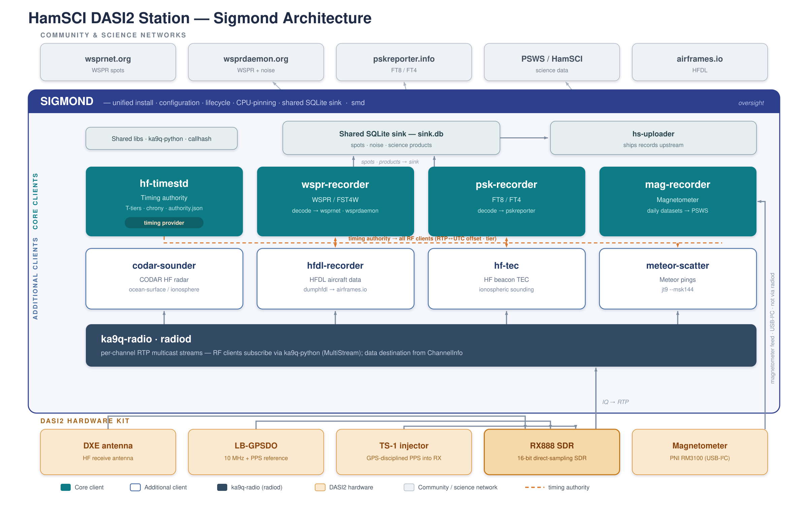

# Sigmond

**SigMonD** (Signal Monitor Daemon) is the installer, lifecycle manager,
and coordinator for the [HamSCI](https://hamsci.org/) SDR observation suite.

Sigmond manages a family of independent clients that share the DASI2
station hardware. **DASI2** is the NSF-funded *Distributed Array of Small
Instruments, Track 2* project — a station is a
[ka9q-radio](https://github.com/ka9q/ka9q-radio)
receiver on an RX888 SDR (GPSDO-disciplined, TS-1 time-injected) plus a
magnetometer.  Each client records a different signal type — WSPR,
FT8/FT4, HF time standards, magnetic field, CODAR, HFDL, beacon TEC,
meteor scatter — and sigmond handles the parts that require coordination
between them: installation, service lifecycle, log aggregation,
diagnostics, timing-authority distribution, the shared SQLite sink, and
resource (CPU) arbitration.

## Architecture at a glance



The **DASI2 hardware kit** (DXE antenna → RX888 SDR, disciplined by an
LB-GPSDO and time-injected by a TS-1, plus a magnetometer) feeds
**ka9q-radio** (`radiod`), which multicasts per-channel RTP streams.
Every RF client subscribes via [ka9q-python](https://github.com/mijahauan/ka9q-python);
**mag-recorder** is the one client that reads its sensor directly (USB-I²C)
rather than through radiod.

- **Core clients:** `hf-timestd` (timing authority — publishes the
  RTP↔UTC offset and tier that the other RF clients label against),
  `wspr-recorder`, `psk-recorder`, `mag-recorder`.
- **Additional clients:** `codar-sounder`, `hfdl-recorder`,
  `hf-tec`, `meteor-scatter`.

Decoded spots / products land in a **shared SQLite sink**
(`/var/lib/sigmond/sink.db`) and are shipped upstream by `hs-uploader`
to wsprnet.org, wsprdaemon.org, pskreporter.info, and PSWS / HamSCI
(HFDL feeds airframes.io directly via `dumphfdl`).  Sigmond is the
oversight layer wrapping the whole software stack: install, configure,
lifecycle, CPU-pinning, and the shared sink.

> The diagram source is [`docs/architecture.svg`](docs/architecture.svg)
> (editable vector, drops straight into slides); a raster copy is at
> [`docs/architecture.png`](docs/architecture.png).

## What you need

**Hardware:**
- An HF antenna
- An [RX-888](https://github.com/ka9q/ka9q-radio) (or other SDR supported by ka9q-radio)
- A GPS disciplined oscillator (e.g. Leo Bodnar GPSDO) providing 10 MHz + PPS
- A Linux computer (Debian 12+ or Ubuntu 22.04+)

**Software prerequisites:**
- Python 3.11 or later
- git
- systemd
- chrony (for time-standard work)

## Quick start

### 1. Install sigmond

Sigmond installs at `/opt/git/sigmond/sigmond/`, peer to its managed
components. Clone and install from there:

```bash
sudo mkdir -p /opt/git/sigmond
sudo chown $USER /opt/git/sigmond
git clone https://github.com/mijahauan/sigmond /opt/git/sigmond/sigmond
cd /opt/git/sigmond/sigmond
./install.sh
```

`install.sh` creates a `sigmond` system user that owns
`/opt/git/sigmond/*`, adds you to the `sigmond` group so you can edit
sources as yourself, sets up `/opt/git/sigmond/sigmond/venv`, and symlinks `smd` to
`/usr/local/bin/smd`. Open a new shell after install (or
`newgrp sigmond`) to pick up the group membership.

> **Running under Proxmox?** `install.sh` detects KVM guests and offers
> to configure the Proxmox host (PCIe passthrough, CPU isolation, vfio,
> hookscript) before installing sigmond — one prompt, one host reboot,
> automatic resume. See [`docs/installation-guide.md`](docs/installation-guide.md)
> "Running under Proxmox VE? Read this first."

### 2. See what's available

```bash
smd component list --catalog
```

```
━━━ catalog — known clients ━━━

  Servers (2)
    ✓  ka9q-radio             ka9q-radio SDR daemon — receives and multicasts RF channels
    ✓  ka9q-web               Web interface for ka9q-radio (radiod status UI)

  Clients (8)
    ✓  codar-sounder          Opportunistic ionospheric sounder using CODAR chirp transmissions  contract=0.8
    ✓  hf-tec                 HF PRN-coded beacon recorder for ionospheric specification  contract=0.8
    ✓  hf-timestd             HF time-standard analyzer (WWV/WWVH/CHU/BPM)  contract=0.8
    ✓  hfdl-recorder          HFDL (High Frequency Data Link) recorder — one dumphfdl subprocess per band  contract=0.8
    ✓  mag-recorder           RM3100 magnetometer recorder + PSWS uploader  contract=0.8
    ✓  meteor-scatter         Meteor-scatter ping recorder/decoder (jt9 --msk144)  contract=0.7
    ✓  psk-recorder           FT4/FT8 spot recorder for PSKReporter  contract=0.8
    ✓  wspr-recorder          WSPR/FST4W audio recorder (period-aligned WAVs)  contract=0.8

  Infra (3)
    ✓  gpsdo-monitor          Leo Bodnar GPSDO health monitor + mDNS advertiser
    ✓  igmp-querier           Robust IGMP querier for radiod multicast on home switches
    ✓  rac                    Remote Access Channel (frpc reverse tunnel)
```

> **Setting up a new host end to end?** See the
> [greenfield install runbook](docs/greenfield-runbook.md) for the
> full ordered walkthrough (identity → radiod → wisdom → tuning →
> clients → validate).

### 3. Install clients

Install whichever clients you need.  Each client's installer handles
everything: creates a service user, Python venv, config template, and
systemd units.

```bash
sudo smd install hf-timestd
sudo smd install psk-recorder
```

Use `--dry-run` to preview what would happen without making changes:

```bash
sudo smd install wspr-recorder --dry-run
```

### 4. Configure

Each client owns its own config file.  After installation, edit the config
for your station:

| Client | Config file |
|--------|-------------|
| radiod | `/etc/radio/*.conf` |
| hf-timestd | `/etc/hf-timestd/timestd-config.toml` |
| psk-recorder | `/etc/psk-recorder/psk-recorder-config.toml` |
| wspr-recorder | `/etc/wspr-recorder/wspr-recorder.toml` |
| mag-recorder | `/etc/mag-recorder/mag-recorder-config.toml` |
| codar-sounder | `/etc/codar-sounder/codar-sounder-config.toml` |
| hfdl-recorder | `/etc/hfdl-recorder/hfdl-recorder-config.toml` |
| hf-tec | `/etc/hf-tec/hf-tec-config.toml` |
| meteor-scatter | `/etc/meteor-scatter/meteor-scatter-config.toml` |

Sigmond's own coordination config lives at `/etc/sigmond/topology.toml`.
Copy the example to get started:

```bash
sudo cp /opt/git/sigmond/etc/topology.example.toml /etc/sigmond/topology.toml
sudo vi /etc/sigmond/topology.toml
```

Enable or disable components by setting `enabled = true` or `false`.

#### Using the TUI (recommended)

Instead of editing config files manually, you can use the interactive TUI:

```bash
sudo smd tui
```

The TUI provides:
- **Install screen** — browse and install components from the catalog
- **Topology screen** — enable/disable components with live validation
- **Overview screen** — system health dashboard
- **Logs screen** — view and filter service logs
- **CPU affinity screen** — configure CPU core isolation
- **CPU frequency screen** — monitor and control CPU frequencies
- **Environment screen** — discover and probe network peers (KIWISDRs, GPSDOs)
- **GPSDO screen** — monitor Leo Bodnar GPSDO health
- **Validate screen** — cross-client harmonization checks
- **Lifecycle screen** — start/stop/restart services
- **Apply screen** — reconcile services with current config
- **List (Software versions) screen** — per-component status (git ref,
  upstream divergence, version policy) with Update All / per-component
  update buttons; replaces the old separate Update screen
- **Backup/Restore screens** — backup and restore configuration

Keybindings: `t` = topology, `i` = install, `v` = validate, `q` = quit

### 5. Start services

```bash
sudo smd start
```

This starts all enabled components in the topology.  To start a single
component (the component name is now a positional argument; an optional
second positional selects a single instance):

```bash
sudo smd start psk-recorder
```

### 6. Check health

```bash
smd status
```

Shows systemd unit state for every managed service, plus inventory data
from each installed client: version, channel count, active frequencies,
and any issues.

## Command reference

`smd`'s verbs are grouped the same way `smd --help` and the TUI present
them. Run `smd <verb> --help` (or `smd admin <verb> --help`) for the full
options on any verb.

**Lifecycle** — operate on running services. Without a component name they
act on all enabled components; a positional component (and optional
instance) narrows the scope.

| Command | Description |
|---------|-------------|
| `smd start [<component> [<instance>]]` | Start managed services |
| `smd stop [<component> [<instance>]]` | Stop managed services |
| `smd restart [<component> [<instance>]]` | Restart with reset-failed |
| `smd reload [--via=auto\|systemd\|socket] [<component>]` | Reload via SIGHUP or restart |
| `smd status [<component>]` | Service health + client inventory |
| `smd enable <name>...` | Set `enabled = true` in topology |
| `smd disable <name>...` | Set `enabled = false` and stop the units |
| `smd apply` | Reconcile running services with current config |

**Install & components**

| Command | Description |
|---------|-------------|
| `smd install [<client>]` | Install + configure a client, or run the full-suite install |
| `smd bringup` | Guided station bring-up from a catalog profile |
| `smd component list [--catalog]` | Per-component status (lifecycle + git ref + version policy); `--catalog` lists what's installable |
| `smd component update [<name>]` | Pull latest and reapply per topology version policy (root) |
| `smd component add\|remove <name>` | Clone/remove a component repo and its topology entry |
| `smd config show\|migrate` | Inspect or migrate coordination config |
| `smd config init\|edit <client>` | Run a client's first-run wizard or edit flow |

**Observe & diagnose** — most diagnostics now live under the `admin` group.

| Command | Description |
|---------|-------------|
| `smd watch <target>` | Live tail for `wspr`, `psk`, `hfdl`, `codar`, `hf-tec`, `mag`, `ka9q`, `radiod`, `uploads`, `verifier` |
| `smd admin log [<client>] [--files] [--level L]` | Follow journal (or `--files` for file logs); `--level` sets the client's level via `coordination.env` + SIGHUP |
| `smd admin diag [net\|cpu-affinity\|cpu-freq]` | Network / CPU diagnostics |
| `smd admin validate` | Cross-client harmonization rules |
| `smd admin environment list\|probe\|describe` | Situational awareness of network peers (KIWISDRs, GPSDOs, NTP) |
| `smd admin verifier\|storage\|sources\|timing\|radiod\|instance\|rac …` | Specialized maintenance — see `smd admin --help` |
| `smd tui` | Launch the interactive TUI configurator |

> **CLI v2 note.** The verb surface was reorganized into `component` /
> `admin` / `config` groups. The old flat verbs **`smd list`, `smd log`,
> `smd diag`, `smd validate`, and `smd environment` no longer exist** — use
> `smd component list` and `smd admin {log,diag,validate,environment}`
> instead. `smd install` and `smd apply` remain available at the top level.
> Lifecycle scope is now positional (`smd start psk-recorder`); the old
> `--components X,Y` flag still works but is deprecated. Full mapping in
> [docs/CLI-V2-SPEC.md](docs/CLI-V2-SPEC.md).

## Monitoring

### Live status

```bash
smd status
```

For each installed client, status shows the systemd unit state plus data
from the client's contract inventory: version, git commit, number of
channels, active modes, and any reported issues.

### Log viewing

Follow the systemd journal for a client:

```bash
smd admin log psk-recorder
```

Tail the client's file logs (spot logs, decode output):

```bash
smd admin log psk-recorder --files
```

### Runtime log level

Change a client's verbosity without restarting:

```bash
sudo smd admin log psk-recorder --level DEBUG
```

This writes `PSK_RECORDER_LOG_LEVEL=DEBUG` to `/etc/sigmond/coordination.env`
and sends SIGHUP to the client's systemd units.  The client re-reads the
environment and adjusts its logger.

To set a default level for all clients (no SIGHUP — restart or SIGHUP each
client to apply):

```bash
sudo smd admin log --level WARNING
```

## Debugging

### Run diagnostics

```bash
smd admin diag
```

Checks:
- Network reachability (wsprnet.org, wsprdaemon services)
- Dependency versions against pinned commits
- Per-client self-validation (`<client> validate --json`)
- Service health

### Check multicast / IGMP readiness

```bash
smd admin diag net        # unprivileged; uses /proc/net/igmp state
sudo smd admin diag net   # adds passive raw-socket listen for queriers
```

Classifies your network for multi-host radiod safety and tells you
whether to stay host-local (`ttl=0`), enable a querier, or avoid a
Wi-Fi path. See [docs/networking.md](docs/networking.md) for the full
guide.

### Cross-client validation

```bash
smd admin validate
```

Runs harmonization rules across all enabled clients: CPU core isolation,
frequency coverage vs. radiod sample rate, radiod reference resolution,
and timing chain verification.

## Adding a discretionary client later

The additional clients (codar-sounder, hf-tec, hfdl-recorder, meteor-scatter)
are installed at your discretion. **Installing a client enables it** — there is
no separate enable step:

```bash
# See what's available
smd component list --catalog

# Install it — this also enables it in topology
sudo smd install hfdl-recorder

# Configure it for your station (first-run wizard, or $EDITOR fallback)
sudo smd config init hfdl-recorder

# Start it
sudo smd start hfdl-recorder

# Verify
smd status
```

The forward path is just **install → configure → start** — there is no
separate `enable` step. `smd install` enables the component, and naming a
component to `smd start` enables it too if it was installed-but-disabled. The
only off-switch you need is `smd disable <name>`, which takes a component
offline reversibly (stops its units and clears the topology flag); `smd start
<name>` brings it back. Pass `smd install --no-enable` to install without
enabling (e.g. to stage config first).

## Available clients

Clients fall into two groups. **Core clients** are the DASI2 grant
station's primary instruments — they install and run by default (the
`dasi2` profile: hf-timestd, wspr-recorder, psk-recorder, mag-recorder).
**Additional clients** extend the same station to other HF science and are
installed **at your discretion** — either all at once during guided
bring-up (`smd bringup dasi2 --with-optional`) or one at a time
(`smd install <name>`, which installs *and* enables it). See
[Adding a discretionary client later](#adding-a-discretionary-client-later).

| Core client | What it does | Repo |
|--------|-------------|------|
| **radiod** | ka9q-radio SDR daemon — receives RF and multicasts IQ channels | [ka9q/ka9q-radio](https://github.com/ka9q/ka9q-radio) |
| **hf-timestd** | HF time-standard analyzer (WWV/WWVH/CHU/BPM) — also the suite's **timing authority** (publishes the RTP↔UTC offset + tier other clients label against) | [mijahauan/hf-timestd](https://github.com/mijahauan/hf-timestd) |
| **wspr-recorder** | WSPR/FST4W recorder + decoder — uploads to wsprnet.org / wsprdaemon.org | [mijahauan/wspr-recorder](https://github.com/mijahauan/wspr-recorder) |
| **psk-recorder** | FT4/FT8 spot recorder — decodes and uploads to PSKReporter | [mijahauan/psk-recorder](https://github.com/mijahauan/psk-recorder) |
| **mag-recorder** | RM3100 magnetometer recorder (USB-I²C, non-radiod) — daily datasets to PSWS | [mijahauan/mag-recorder](https://github.com/mijahauan/mag-recorder) |

| Additional client | What it does | Repo |
|--------|-------------|------|
| **codar-sounder** | Opportunistic ionospheric sounder using CODAR chirp transmissions | [mijahauan/codar-sounder](https://github.com/mijahauan/codar-sounder) |
| **hfdl-recorder** | HFDL (High Frequency Data Link) recorder — one `dumphfdl` subprocess per band (→ airframes.io) | [mijahauan/hfdl-recorder](https://github.com/mijahauan/hfdl-recorder) |
| **hf-tec** | HF PRN-coded beacon recorder for ionospheric specification (TEC) | [mijahauan/hf-tec](https://github.com/mijahauan/hf-tec) |
| **meteor-scatter** | Meteor-scatter ping decoder (`jt9 --msk144`) → local sink + hs-uploader | [mijahauan/meteor-scatter](https://github.com/mijahauan/meteor-scatter) |

### Infrastructure components

| Component | What it does | Repo |
|-----------|-------------|------|
| **igmp-querier** | IGMPv2 querier daemon — keeps multicast streams alive on LANs without a router | [mijahauan/igmp-querier](https://github.com/mijahauan/igmp-querier) |
| **rac** | Remote Access Channel — frpc reverse tunnel to gw2.wsprdaemon.org for admin SSH/web behind NAT | [mijahauan/rac](https://github.com/mijahauan/rac) |
| **gpsdo-monitor** | Leo Bodnar GPSDO health monitor + mDNS advertiser | [mijahauan/gpsdo-monitor](https://github.com/mijahauan/gpsdo-monitor) |

The RF clients use [ka9q-python](https://github.com/mijahauan/ka9q-python)
to receive RTP streams from radiod; `mag-recorder` is the exception — it
reads its magnetometer directly over USB-I²C, not through radiod.  Each
client runs in its own Python venv and manages its own systemd services.
Decoded spots / products are written to the shared SQLite sink
(`/var/lib/sigmond/sink.db`) and shipped upstream by `hs-uploader`.

> **Why a station is worth more as part of a network:** each DASI2 node already
> carries several GPS-co-registered ionospheric instruments — `hf-timestd`
> (dTEC), `hf-tec` (coded-beacon absolute TEC), `codar-sounder` (oblique
> sounding / MUF), `hfdl-recorder` (dense opportunistic paths), and
> `mag-recorder` (the geomagnetic *driver*) — so a single node is already a
> multi-modal observatory. Replicated across the map, the mesh becomes a
> distributed-aperture instrument that can *image* travelling ionospheric
> disturbances, sense TEC gradients by differencing receivers that share a
> transmitter, and feed tomographic TEC — and it is resilient to the steady loss
> of the HF time standards it listens to (CHU included). See
> [**docs/STATION-NETWORK-CAPABILITIES.md**](docs/STATION-NETWORK-CAPABILITIES.md).

## How it works

Sigmond follows a layered architecture:

1. **Catalog** — static registry of known clients (`etc/catalog.toml`).
   Answers "what could be installed on this host?"
2. **Installer** — clones a client repo and delegates to its `install.sh`.
   Each client's installer is authoritative; sigmond never duplicates it.
3. **Topology** — per-host config (`/etc/sigmond/topology.toml`).
   Declares which components are enabled.
4. **Lifecycle** — resolves systemd units from each client's `deploy.toml`,
   expands templated units, discovers instances, and drives
   start/stop/restart/reload.
5. **Logging** — aggregates logs across clients via the client contract's
   `log_paths` and `log_level` fields.
6. **Harmonization** — cross-client validation rules that catch conflicts
   (CPU overlap, multicast collisions, missing dependencies).

Each client conforms to the [HamSCI client contract](docs/CLIENT-CONTRACT.md),
which defines a standard interface: `inventory --json`, `validate --json`,
`deploy.toml`, systemd unit conventions, and logging discipline.

## Development

Sigmond's core `smd` command is deliberately stdlib-only so it can run from
`/usr/local/bin/smd` without any venv. The TUI (`smd tui`) and the test
suite do require external packages; those live in a venv driven by
[pyproject.toml](pyproject.toml).

### Dev venv

uv is the standard; `.python-version` pins the interpreter and `uv.lock`
pins resolved deps.

```bash
uv sync --extra tui --extra dev        # creates .venv/ with textual, rich, pytest
```

For the coordinated dev flow that also installs `ka9q-python` editable from a
sibling checkout, use the hamsci-workspace meta-repo (see that README) or
the legacy pip-based helper:

```bash
./scripts/dev-setup.sh                 # pip fallback; auto-locates ../ka9q-python
```

### Running tests

```bash
uv run pytest tests/
# or: .venv/bin/pytest tests/
```

### Running the TUI from the repo

```bash
uv run python bin/smd tui
# or: .venv/bin/python bin/smd tui
```

`smd tui` imports `sigmond.tui` using the current interpreter first;
if that fails, it re-execs into the production venv at `/opt/git/sigmond/sigmond/venv/`
(auto-created on a root install). So the dev `.venv` and the installed
`/opt/git/sigmond/sigmond/venv` both work the same way — one declaration, two locations.

### Production venv

The installer creates `/opt/git/sigmond/sigmond/venv/` and installs sigmond
(editable, with the `tui` extra) into it. When that venv exists, `smd`
re-execs into its interpreter on **every** invocation — not just `tui` — so
the full dependency closure (including `ka9q-python`, which the
harmonization rules import) is always available. The re-exec is skipped only
when the venv is absent (a fresh or dev checkout), when `smd` is already
running from it, or when `SIGMOND_NO_VENV_REEXEC=1` is set. Keeping the core
stdlib-only is what lets that pre-venv bootstrap and the escape hatch work.

## Project

- **Authors:** Michael Hauan (AC0G), Rob Robinett (AI6VN)
- **License:** TBD
- **Repo:** https://github.com/mijahauan/sigmond
- **Part of:** [HamSCI](https://hamsci.org/) — Ham Radio Science Citizen Investigation
